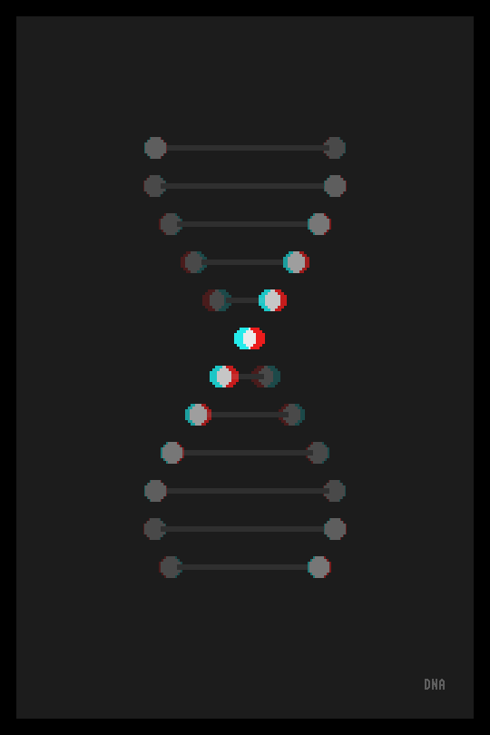

Collection of GIFs created using Processing.  
I do not own the rights for these animations.
Created for educational purposes.  
Gif 1:  
  
Gif 2:  
  
Gif 3:  
  
Gif 4:  
  
Gif 5:  
  
Gif 6:  
  
Gif 7:  
  
Gif 8:  
  
Gif 9:  
  
Gif 10:  
  
